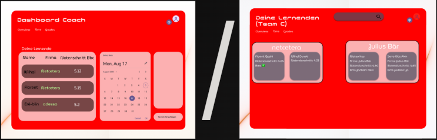

# L.E.O. (Learning Experience Organizer)
#### Ein Lernmanagementsystem für die Berufsbildung

## 📋 Inhaltsverzeichnis
1. [Einführung](#einführung)
2. [Projektantrag & Planung](#projektantrag--planung)
3. [Anforderungsanalyse](#anforderungsanalyse)
4. [Design & Architektur](#design--architektur)
5. [Implementierung](#implementierung)
6. [Herausforderungen](#herausforderungen)
7. [Testing & Qualitätssicherung](#testing--qualitätssicherung)
8. [Fazit & Reflexion](#fazit--reflexion)
9. [API-Dokumentation](#api-dokumentation)
10. [Installationsanleitung](#installationsanleitung)

## Einführung

### Projektkontext
Das L.E.O. Projekt entstand aus der Notwendigkeit heraus, den Berufsbildungsprozess für Lernende und ihre Coaches zu optimieren. Als Lernender selbst erlebte ich, wie mühsam es ist, Zeiten und Noten zu verwalten oder Feedback zu erhalten. Das Projekt wurde in einem vierköpfigen Team (Erë-blin, Florent, Matteo, Dzhangr ) über einen Zeitraum von drei Wochen im Mai 2025 entwickelt.

### Vision & Ziele
Unsere Vision war es, eine Plattform zu schaffen, die:
- Den administrativen Aufwand für Lernende und Coaches minimiert
- Eine transparente Übersicht über den Bildungsfortschritt ermöglicht
- Die Kommunikation zwischen allen Beteiligten vereinfacht
- Eine zeitgemässe, benutzerfreundliche Oberfläche bietet
- Rollenbasierte Zugriffsrechte (Admin, Coach, Student) implementiert
- Ein integriertes Feedback- und Bewertungssystem bereitstellt
- Übersichtliche, rollenspezifische Dashboards anbietet
- Ein mobilefreundliches und modernes Design gewährleistet

## Projektantrag & Planung

### Initialer Projektantrag
Das Projekt begann mit einer detaillierten Analyse der Anforderungen und der Erstellung eines ersten Entity-Relationship-Diagramms (ERD). Die erste Version des ERDs wurde auf einem Whiteboard entwickelt und zeigte die grundlegenden Entitäten:

- Feedback (id, text, point, title)
- Student (id, username, email, password, birthdate, city, class, bms)
- Time (id, startDay, lunchstart, lunchfinish, finishDay, comment, date)
- Grade (id, score, date, subject)
- Coach (id, username, email, password, birthdate, city, team)
- Admin (id, username, email, password)

Der iterative Entwicklungsprozess führte zu einem verfeinerten ERD, das als Grundlage für die Datenbankimplementierung diente. Das finale ERD zeigt die optimierten Beziehungen zwischen den Entitäten und berücksichtigt zusätzliche Anforderungen wie:
- Verbesserte Referenzintegrität
- Optimierte Beziehungen zwischen Coach und Student
- Erweiterte Attribute für Feedback und Zeiterfassung

### Methodik & Werkzeuge
Das Projekt wurde nach Scrum-Methodologie umgesetzt mit:
- Täglichen Dailies im Meetingraum ZH-Einstein
- Sprint-Planung und Review-Meetings mit dem Kunden (Michael)
- User Stories mit T-Shirt-Sizing
- Dokumentiertem Kommunikationsfluss über E-Mail, Präsentationen und Chatprotokolle

Eingesetzte Tools:
- GitHub für Codeverwaltung & Issues
- Visual Studio Code, IntelliJ IDEA
- Figma für UI-Designs
- MySQL Workbench
- Swagger UI für API-Tests
- Docker 

### Design-Evolution

#### ERD Evolution
Die Entwicklung des Datenbankdesigns erfolgte in mehreren Schritten:

1. **Initiales Whiteboard-ERD (Bild 1 & 2)**
Die ersten Entwürfe auf dem Whiteboard zeigten die grundlegenden Entitäten:
- Feedback (id, text, point, title)
- Student (id, username, email, password, birthdate, city, class, bms)
- Time (id, startDay, lunchstart, lunchfinish, finishDay, comment, date)
- Grade (id, score, date, subject)
- Coach (id, username, email, password, birthdate, city, team)
- Admin (id, username, email, password)


2. **Finales ERD (Bild 3)**
Das finale ERD wurde für die Backend-Implementierung optimiert und zeigt:
- Verbesserte Referenzintegrität zwischen Entitäten
- Klare Beziehungen zwischen Coach und Student
- Optimierte Attribute für Time und Feedback


#### Frontend Design-Iteration

1. **Erste Figma-Designs (Bild 4 & 5)**
Die initialen UI-Designs in Figma beinhalteten:
- Registrierungsformular mit:
  - Vorname/Nachname
  - Benutzername
  - Lehrfirma
  - PLZ/Wohnort
  - Klasse (Berufsschule)
  - Geburtsdatum
  - BMS Toggle
- Validierung der Eingaben
- Responsives Layout


2. **Kundenbasierte Anpassungen (Bild 6)**
Nach dem ersten Kundenfeedback wurde das Design überarbeitet mit:
- Übersichtsseite mit Wochen- und Monatsansicht
- Detaillierte Zeiterfassung:
  - Start: 07:35
  - Mittagspause: 12:00 - 13:00 (min. 30 Minuten)
  - Ende: 16:30
  - Automatische Dauerberechnung
  - Kommentarfeld
- Angepasste Farbtöne für ruhigeres Design
- Optimierte Firmengruppierung


3. **Finales Design (Bild 7)**
Das finale Design wurde nach weiteren Kundengesprächen optimiert:
- Rollenspezifische Dashboards
- Verbesserte Navigation
- Intuitive Zeiterfassung mit Validierung
- Übersichtliche Notenansicht mit Durchschnittsberechnung
- Integriertes Feedback-System mit Sternebewertung
- Optimierte Informationsstruktur



### Kundeninteraktion

#### Erstes Review-Meeting (12. Mai 2025)
- Datum: Montag, 12. Mai 2025, 13:30 Uhr
- Ort: ZH-Einstein
- Ziele:
  - Präsentation des initialen Projektstands
  - Aufnahme von Kundenfeedback
  - Festlegung weiterer Meilensteine

#### Sprint-Planning (Bild 8)
Definierte User Stories mit T-Shirt-Sizing:
- Coach-Anmeldung und Dateneinsicht (Frontend) (S)
- Admin-Benutzerverwaltung (Backend) (L)
- Coach-Registrierung durch Admin (Frontend) (S)
- Zeiterfassungseinsicht für Coaches (Backend: L, Frontend: M)


#### Review-Meeting (20. Mai 2025)
Wichtige Erkenntnisse und Feedback:
- Design soll stärker dem Figma-Layout folgen
- Implementierung rollenspezifischer Dashboards
- Überarbeitung der Noten- und Zeiterfassung
- Coach-Registrierung ausschließlich durch Admin

Nächste Schritte:
- Überarbeitung der Noten- und Zeiterfassung
- Entwicklung verschiedener Dashboards für Student, Coach und Admin
- Implementierung der Coach-Registrierung über Admin-Interface

### Zeitplanung
Die Entwicklung wurde in drei intensive Wochen aufgeteilt:

#### Woche 1: Grundlagen
- Projektsetup und initiale Architekturentscheidungen
- Datenbank-Schema-Design basierend auf dem ERD
- Einrichtung der React/Vite Entwicklungsumgebung
- Implementierung des Authentifizierungssystems
- **Meilenstein:** Funktionierende Benutzerregistrierung

[Hier würde ich gerne die ersten UI-Mockups einfügen]

#### Woche 2: Kernfunktionen
- Entwicklung des Zeiterfassungssystems
- Implementation der Notenverwaltung
- Erstellung der Benutzerprofile
- **Meilenstein:** Funktionierendes Zeiterfassungssystem

#### Woche 3: Integration & Polishing
- Entwicklung des Coach-Zuweisungssystems
- Fertigstellung des Admin-Dashboards
- UI/UX-Verbesserungen
- Bugfixing und Testing
- **Meilenstein:** Vollständig funktionierendes System

## Anforderungsanalyse

### Funktionale Anforderungen

#### Benutzerverwaltung
- Registrierung für Lernende
- Admin-gesteuerte Coach-Registrierung
- Rollenbasierte Zugriffsrechte (STUDENT, COACH, ADMIN)
- Profilmanagement

#### Zeiterfassung
- Tägliche Arbeitszeiterfassung
- Pausenverwaltung
- Abwesenheitsmeldungen
- Automatische Berechnung der Arbeitszeit

#### Notenverwaltung
- Erfassung verschiedener Notentypen
- Gewichtung der Noten
- Durchschnittsberechnung
- Notenverlauf

#### Coach-System
- Zuweisung von Lernenden zu Coaches
- Übersicht über zugewiesene Lernende
- Einsicht in Zeiten und Noten
- Feedback-Möglichkeit

### Nicht-funktionale Anforderungen
- Performance: Ladezeiten < 2 Sekunden
- Sicherheit: JWT-basierte Authentifizierung
- Usability: Intuitive Benutzeroberfläche
- Wartbarkeit: Modulare Codebasis
- Skalierbarkeit: Microservice-ready Architektur

## Design & Architektur

### Frontend-Architektur
Das Frontend basiert auf React mit Vite und folgt einer komponenten-basierten Architektur:

```
frontend/
├── src/
│   ├── components/    # Wiederverwendbare UI-Komponenten
│   ├── routes/       # Seitenspezifische Komponenten
│   ├── lib/          # Utilities und API-Funktionen
│   └── styles/       # CSS-Module und globale Styles
```

[Hier würde ich gerne Screenshots der fertigen Anwendung einfügen]

### Backend-Architektur
Das Backend wurde mit Spring Boot entwickelt und folgt einer klassischen Mehrschichtarchitektur:

```
backend/
├── src/
│   └── main/
│       └── java/
│           ├── controller/  # REST-Endpoints
│           ├── service/     # Geschäftslogik
│           ├── repository/  # Datenbankzugriff
│           └── model/       # Entitäten
```

### Datenbank-Schema
Die Datenbank wurde mit MySQL realisiert und umfasst folgende Hauptentitäten:
- Users (mit Vererbung für Student/Coach)
- Grades (Notenverwaltung)
- TimeEntries (Zeiterfassung)
- Relationships (Coach-Student-Zuweisungen)

[Hier würde ich gerne das finale ERD-Diagramm einfügen]

## Implementierung

### Authentifizierungssystem
Das JWT-basierte Authentifizierungssystem wurde wie folgt implementiert:
- Token-Generierung bei Login
- Role-based Access Control (RBAC) mit @PreAuthorize
- Sichere Passwort-Hashing mit BCrypt
- Session-Management im Frontend
- Rollenspezifisches Routing

### Zeiterfassungssystem
Die Zeiterfassung wurde benutzerfreundlich gestaltet:
- Automatische Pausenerkennung (min. 30 Minuten)
- Flexible Zeiteinträge mit Validierung
- Überstundenberechnung
- Monatsübersicht mit Summenberechnung
- Kommentarfeld für Besonderheiten

### Notenverwaltung
Die Notenverwaltung bietet:
- Verschiedene Notentypen (Test, Projekt, etc.)
- Gewichtungssystem
- Grafische Darstellung des Notenverlaufs
- Fachspezifische Durchschnittsberechnung (Ø)
- Integration mit Feedback-System

### Feedbacksystem
Das Bewertungssystem wurde nach Kundenanforderungen implementiert:
- Sternebewertung (1-5)
- Titel und Kommentartext
- Bewertungskriterien (Startzeit, Pausendauer)
- Transparente UI-Integration
- Verknüpfung mit Lernenden-Profilen

### Admin-Dashboard
Das Admin-Dashboard ermöglicht:
- Komplette Benutzerverwaltung
- Coach-Zuweisung
- Systemüberwachung
- Nutzungsstatistiken

## Herausforderungen

### Technische Herausforderungen
1. **JSON-Serialisierung**
   - Problem: StackOverflow bei zyklischen Abhängigkeiten
   - Lösung: Einführung von LightDTOs für Coach/Student

2. **Komplexe Rollenlogik**
   - Problem: Verschachtelte Zugriffsrechte
   - Lösung: @PreAuthorize + central RoleHandler

3. **Datenkonsistenz**
   - Problem: DTO-Fehler durch inkonsistente Daten
   - Lösung: Verbessertes DTO-Mapping und Validation

4. **Zeitberechnungen**
   - Problem: Komplexe Arbeitszeitregeln mit Pausenvalidierung
   - Lösung: Zentrale Utility-Klasse + TimeValidatorService

### Persönliche Herausforderungen
- Zeitmanagement bei komplexen Features
- Balancierung von Perfektionismus und Pragmatismus
- Technische Entscheidungsfindung
- Unter Druck arbeiten (auf letzten Drücker -> letzter Sprint)
## Testing & Qualitätssicherung

### Testabdeckung
- Unit Tests für kritische Businesslogik
- Integration Tests für API-Endpoints
- End-to-End Tests für kritische User Flows

### Qualitätssicherung
- Continuous Integration mit GitHub Actions
- Code Reviews
- Sonar Lint für Code-Qualität
- Manuelle Tests für UI/UX

## Fazit & Reflexion

### Projektabschluss
Das Projekt wurde erfolgreich innerhalb des Zeitrahmens abgeschlossen. Alle Kernfunktionen wurden implementiert und getestet.

### Technische Learnings
- Vertieftes Verständnis von Spring Boot
- React Best Practices und Patterns
- Sicherheitsaspekte in Webanwendungen
- Datenbankdesign und -optimierung

### Persönliche Entwicklung
- Verbesserte Projektmanagement-Fähigkeiten
- Gesteigerte Problemlösungskompetenz
- Effizientere Zeiteinteilung
- Besseres Verständnis für User Experience

### Ausblick
Geplante Verbesserungen:
1. Erweitertes Reporting
   - Anpassbare Berichte
   - Export-Funktionen
   - Statistische Auswertungen

2. UI/UX Optimierungen
   - Dark Mode
   - Mobile Optimierung
   - Accessibility Verbesserungen

3. Neue Features
   - Chat-System
   - Dokumenten-Upload
   - Kalenderintegration

## API-Dokumentation

### Authentication Endpoints
- POST `/users/signin` - User login
- POST `/users/signup-student` - Student registration
- POST `/users/signup-coach` - Coach registration (admin only)

### Student Endpoints
- GET `/students` - List all students
- GET `/students/{id}` - Get student details
- PUT `/students/{id}` - Update student
- PUT `/students/{studentId}/assign-coach/{coachId}` - Assign coach

### Coach Endpoints
- GET `/coaches` - List all coaches
- GET `/coaches/{id}` - Get coach details
- PUT `/coaches/{id}` - Update coach
- DELETE `/coaches/{id}` - Delete coach

### Time Entry Endpoints
- GET `/times` - List time entries
- POST `/times` - Create time entry
- PUT `/times/{id}` - Update time entry
- DELETE `/times/{id}` - Delete time entry

### Grade Endpoints
- GET `/grades/student/{studentId}` - Get student grades
- POST `/grades` - Create grade
- PUT `/grades/{id}` - Update grade
- DELETE `/grades/{id}` - Delete grade

For detailed API documentation and request/response formats, refer to the Swagger documentation available at `/swagger-ui.html` when running the application.

## Installationsanleitung

### Voraussetzungen
- Node.js und npm
- Java 17 oder höher
- MySQL-Datenbank
- Docker

### Datenbank-Setup
1. Erstellen Sie die Datenbank mit MySQL Workbench oder der Kommandozeile:
```sql
CREATE DATABASE `backend-db`;
```

### Frontend-Setup
1. Navigieren Sie in das Frontend-Verzeichnis:
```bash
cd frontend
```
2. Installieren Sie die Abhängigkeiten:
```bash
npm install
```
3. Starten Sie den Entwicklungsserver:
```bash
npm run dev
```

### Backend-Setup
1. Navigieren Sie in das Backend-Verzeichnis:
```bash
cd backend
```
2. Starten Sie die Spring Boot Anwendung:
```bash
./gradlew bootRun
```

Die Anwendung ist verfügbar unter:
- Frontend: http://localhost:5173
- Backend API: http://localhost:8080
- Swagger-Dokumentation: http://localhost:8080/swagger-ui.html